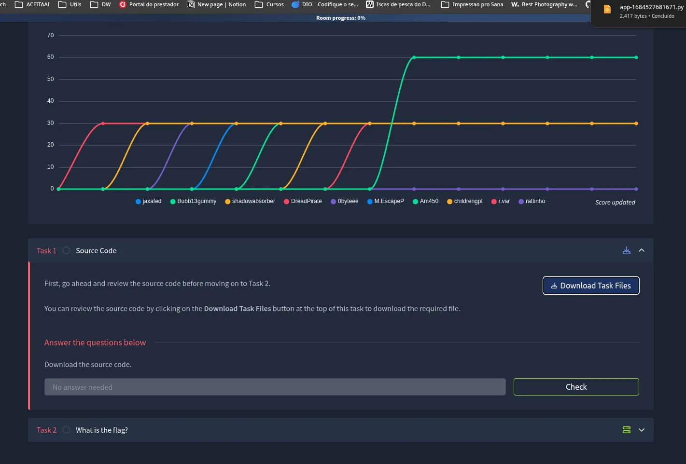
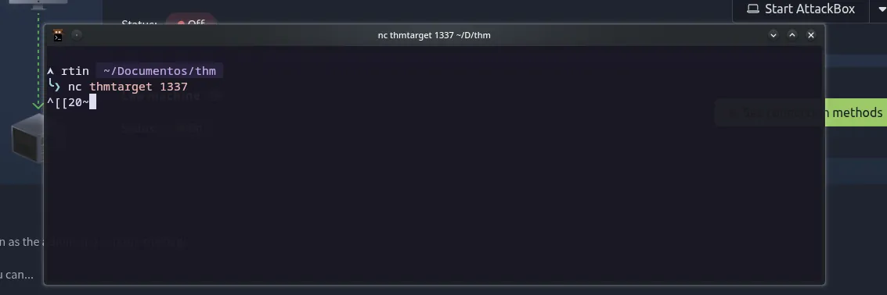
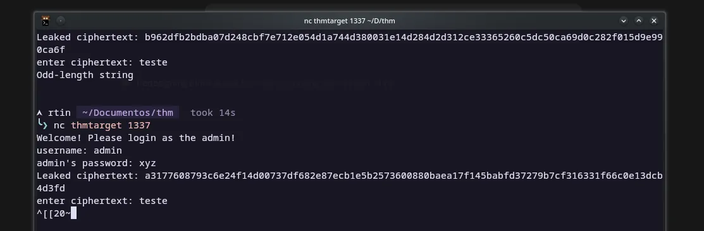
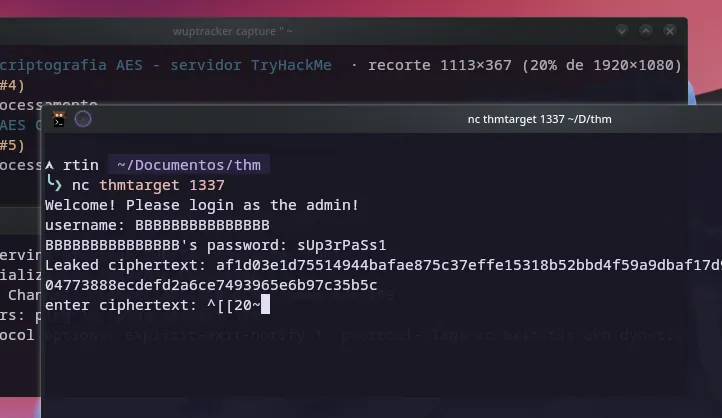
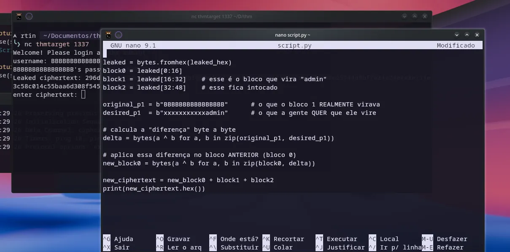
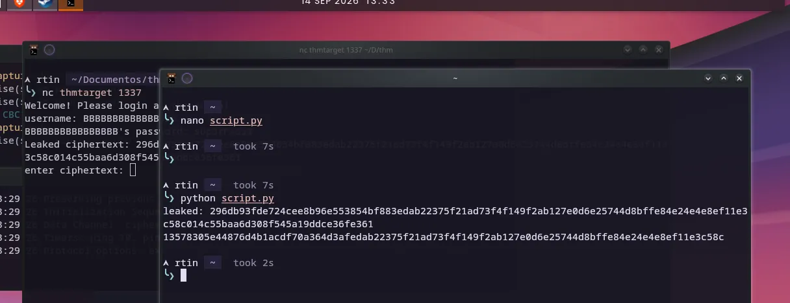
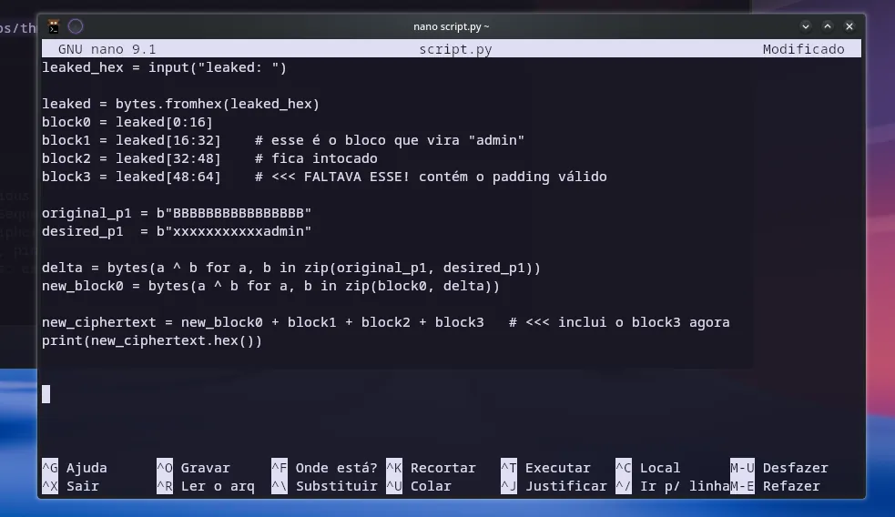
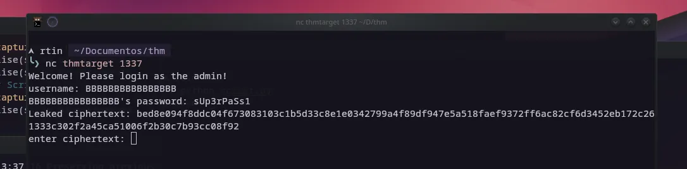
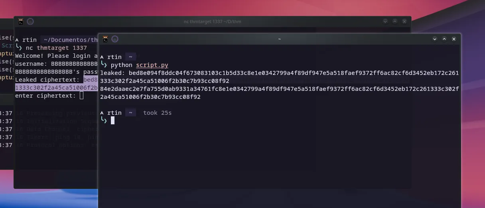
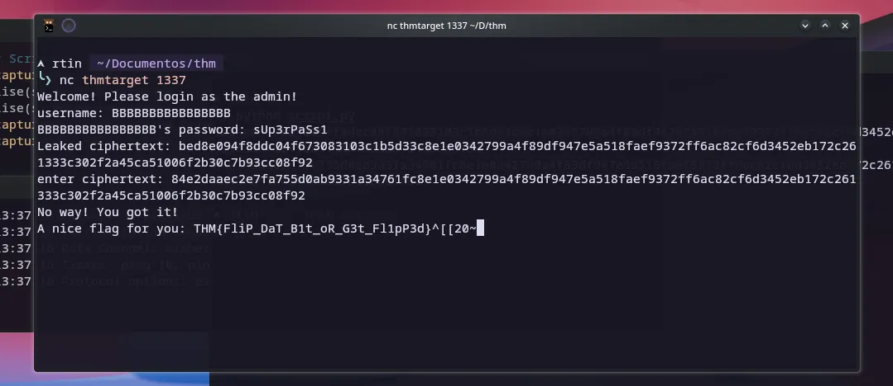

# Flip — TryHackMe

A sessão começou com o reconhecimento da sala **Flip**, no TryHackMe, através do navegador. Na Task 1 (Source Code) foi baixado o código-fonte do desafio, `app-1684527681671.py` (2.417 bytes), que serviria de base para toda a análise posterior.



Com o IP da VPN em `192.168.129.205` e a máquina alvo em `10.66.178.37`, a conexão ao serviço foi estabelecida via netcat na porta 1337:

```
nc thmtarget 1337
```



O serviço se revelou um desafio de criptografia AES: pedia login como `admin` e, no processo, vazava ciphertexts. Uma tentativa inicial com a senha `teste` (também usada como ciphertext) resultou em erro `Odd-length string`, evidenciando que o campo esperava um valor em hexadecimal válido. Dois ciphertexts foram capturados nesse ponto:

```
b962dfb2bdba07d248cbf7e712e054d1a744d380031e14d284d2d312ce33365260c5dc50ca69d0c282f015d9e990ca6f
a3177608793c6e24f14d00737df682e87ecb1e5b2573600880baea17f145babfd37279b7cf316331f66c0e13dcb4d3fd
```



A análise do código-fonte do servidor (funções `encrypt_data`/`decrypt_data`) mostrou que a autenticação usava AES em modo **CBC**, verificando após o unpad a string `admin&password=sUp3rPaSs1`. A chave e o IV eram gerados aleatoriamente (`get_random_bytes(16)`) a cada sessão, mas a lógica de verificação do payload decifrado abria margem para um ataque de **bit-flipping** em CBC, já que não havia verificação de integridade (MAC) sobre o ciphertext.

O passo seguinte foi enviar um username controlado — uma sequência de 16 bytes `B` (`BBBBBBBBBBBBBBBB`) — junto da senha `sUp3rPaSs1`, o que fez o serviço vazar um novo ciphertext, desta vez com um bloco de plaintext totalmente conhecido pelo atacante:

```
af1d03e1d75514944bafae875c37effe15318b52bbd4f59a9dbaf17d923d086786859fca375690f20f62bec12e604773888ecdefd2a6ce7493965e6b97c35b5c
```



Com esse ciphertext em mãos, a exploração migrou para um script Python (`script.py`, editado via `nano`) implementando o ataque de bit-flipping em CBC. A ideia: já que em CBC o plaintext de um bloco `Pn = Dec(Cn) XOR C(n-1)`, alterar bytes do bloco anterior `C(n-1)` altera de forma previsível (via XOR) o plaintext decifrado do bloco seguinte. O script separava o ciphertext vazado em blocos de 16 bytes (`block0`, `block1`, `block2`), definia o plaintext original conhecido (`BBBBBBBBBBBBBBBB`) e o plaintext desejado (`xxxxxxxxxxxxadmin`), calculava o delta via XOR entre os dois, e aplicava esse delta ao bloco anterior para forjar um novo bloco que, ao ser decifrado, resultaria em `admin`:

```python
leaked = bytes.fromhex(leaked_hex)
block0 = leaked[0:16]
block1 = leaked[16:32]
block2 = leaked[32:48]
original_p1 = b"BBBBBBBBBBBBBBBB"
desired_p1  = b"xxxxxxxxxxxxadmin"
delta = bytes(a ^ b for a, b in zip(original_p1, desired_p1))
new_block0 = bytes(a ^ b for a, b in zip(block0, delta))
new_ciphertext = new_block0 + block1 + block2
print(new_ciphertext.hex())
```


Ao reconectar e reenviar o ciphertext forjado (`nc thmtarget 1337` + `nano script.py`), ficou claro que faltava considerar um quarto bloco de 16 bytes contendo o padding PKCS#7 válido — sem ele, o ciphertext ficava incompleto e o unpad falhava no servidor:




O script foi então corrigido para incluir também `block3` (o bloco de padding) na reconstrução final do ciphertext:

```python
leaked_hex = input("leaked: ")
leaked = bytes.fromhex(leaked_hex)
block0 = leaked[0:16]
block1 = leaked[16:32]
block2 = leaked[32:48]
block3 = leaked[48:64]
original_p1 = b"BBBBBBBBBBBBBBBB"
desired_p1  = b"xxxxxxxxxxxxadmin"
delta = bytes(a ^ b for a, b in zip(original_p1, desired_p1))
new_block0 = bytes(a ^ b for a, b in zip(block0, delta))
new_ciphertext = new_block0 + block1 + block2 + block3
print(new_ciphertext.hex())
```



Com o script corrigido, uma nova conexão foi aberta, novamente enviando o username de 16 `B`s e a senha `sUp3rPaSs1`, o que vazou o ciphertext definitivo:

```
bed8e094f8ddc04f673083103c1b5d33c8e1e0342799a4f89df947e5a518faef9372ff6ac82cf6d3452eb172c261333c302f2a45ca51006f2b30c7b93cc08f92
```



Esse ciphertext foi processado pelo script de bit-flipping, gerando a versão manipulada:

```
84e2daaec2e7fa755d0ab9331a34761fc8e1e0342799a4f89df947e5a518faef9372ff6ac82cf6d3452eb172c261333c302f2a45ca51006f2b30c7b93cc08f92
```



Ao enviar esse ciphertext forjado de volta ao serviço via `nc thmtarget 1337`, o servidor decifrou o payload manipulado, aceitou o login como `admin` sem que a senha real fosse conhecida, e retornou a flag:

```
FLAG: THM{FliP_DaT_B1t_oR_G3t_Fl1pP3d}
```



O desafio, consistente com seu nome, explorava exatamente a maleabilidade do modo CBC (bit-flipping) na ausência de autenticação de integridade do ciphertext, permitindo forjar o login de administrador sem nunca descobrir a senha real.
